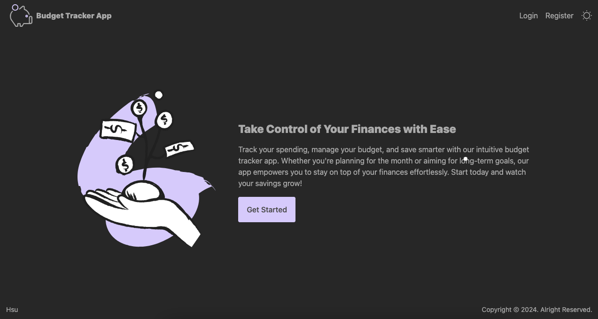
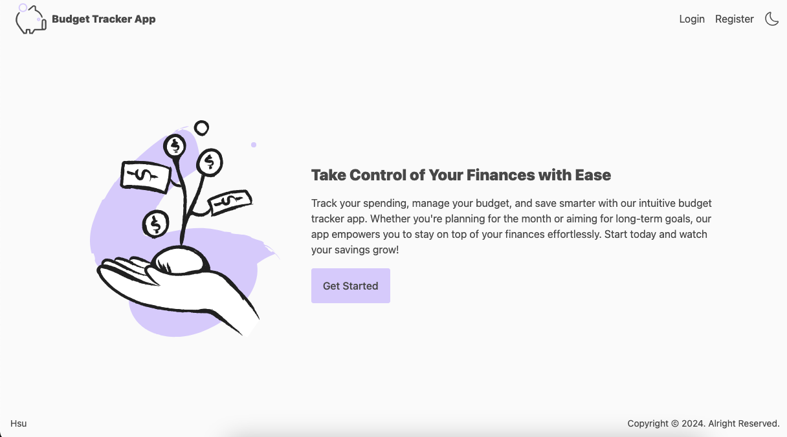
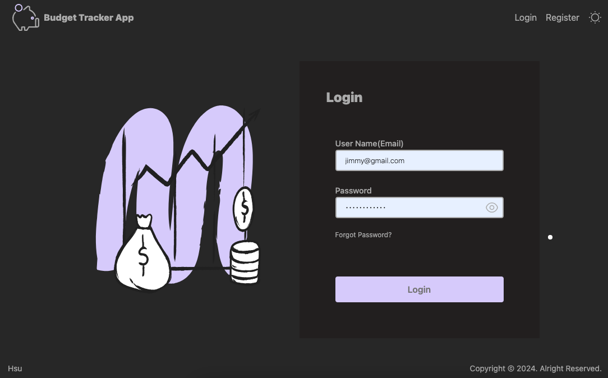
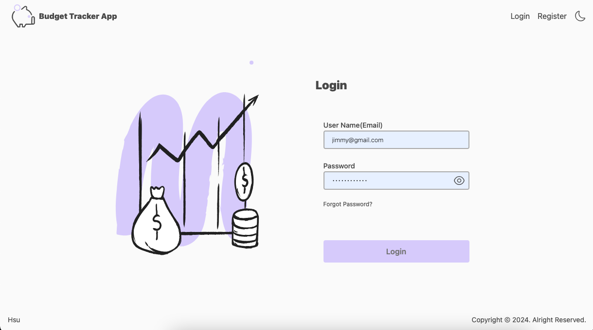
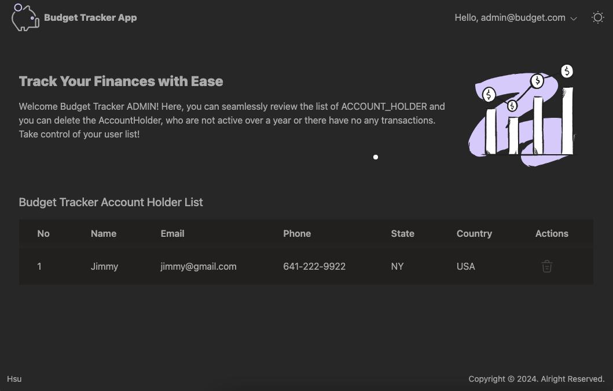
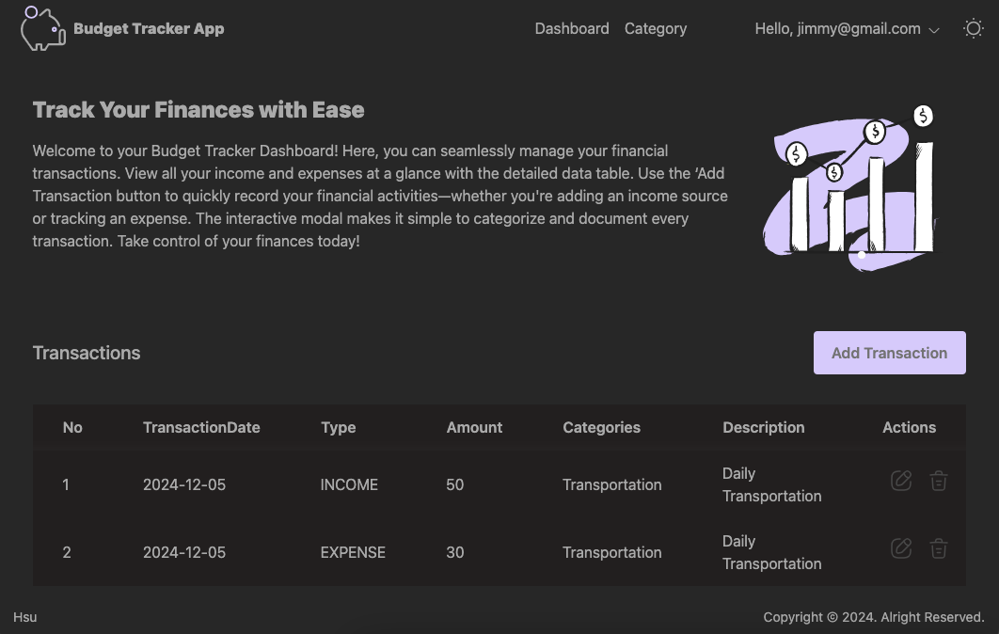

# PersonalBudgetTracker

# Front-end

### Functional Requirements:

- **Welcome**:
  
  
- **User Login**:
  
  
- ## Admin Dashboard
  
- ## AccountHolder Dashboard
  

---

## Software Setup Instructions(Locally):

### Technologies Used

- React.js (ver: 18.3.1)
- Tailwind(ver: 3.4.15), HTML5
- **Version Control**: GitHub
- **Cloud**: Azure

### Prerequisites

- Node.js and npm installed

### Steps

1. Clone the repositories:

#### Frontend

```bash
git clone https://github.com/HsuMinHtet/PersonalBudgetTracker_Frontend.git
```

2. Navigate to the directories:
   ```bash
    cd PersonalBudgetTracker_Frontend
   ```
3. Install dependencies:

#### For Frontend:

```bash
npm install
```

4. Run the application:

#### For Backend:

###### 1. Configure API URL in /src/config/apiCongig.js

###### 2. Admin User is initially registered at Application Class.(admin@budget.com,password@123) as default

```bash
npm run dev
```
